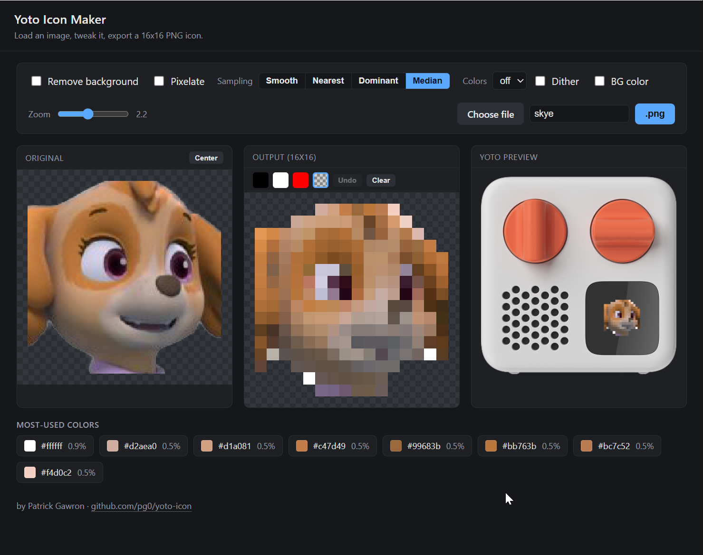
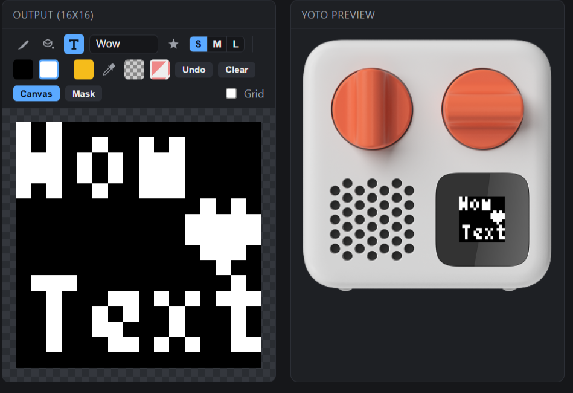
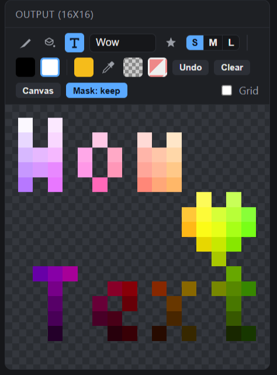

# Yoto Icon Maker

Browser tool to turn any image into a 16x16 PNG icon for the [Yoto player](https://yotoplay.com) display. Single HTML file, no dependencies, no build step, fully client-side - open `index.html` and go.

## Features

- **Input**: file picker, drag & drop, or paste (Ctrl+V)
- **Crop & align**: drag to pan (also beyond the image edges), mouse-wheel / slider zoom 0.25x-5x, center reset
- **Background removal**: corner-seeded flood fill with tolerance slider
- **Pixelate**: grid sizes 16-128
- **Sampling modes**: Smooth (area average), Nearest, Dominant (most frequent color per cell), Median
- **Color reduction**: median-cut quantization to 4/8/16/32 colors, optional Floyd-Steinberg dithering
- **Background color**: optional solid fill behind the icon
- **Paint**: pencil and bucket-fill tools; black / white / custom color / eraser (transparent hole) / rubber (restore image) brushes on the 16x16 grid, undo (Ctrl+Z), clear
- **Text**: stamp pixel text in three sizes (Tom Thumb 3x6, classic 5x7 dot-matrix, or system-font raster at 16px), with a special-character palette (hearts, stars, dots, diamonds, smileys) and live hover preview
- **Mask**: use the painted area as a stencil (keep) or cutout (cut) of the image instead of drawing color
- **Emoji to icon**: type or pick an emoji and convert it to 16x16 pixel art via the system emoji font, with Sharp / Balanced / Soft quality
- **Symmetry**: live mirror while painting - horizontal, vertical, or quad; the pencil, bucket-fill, and text tools all respect it
- **Move**: shift the whole painted drawing by dragging with the Move tool, or nudge one pixel with the arrow keys
- **Live preview**: original | 16x16 output | mockup on a Yoto Mini photo
- **Palette**: most-used colors with hex + share, click to copy
- **Export**: true 16x16 PNG with transparency, custom filename

## Why 16x16?

The Yoto player renders icons at 16x16 physical pixels. The tool processes and exports at exactly that resolution, so what you see in the output panel is what the device shows.

## Usage

Open `index.html` in any modern browser. Everything runs locally; no image ever leaves your machine.

## Teaser / currently testing
- **Text**: add Text and Symbols easy

 

- **Masks**: use paint as image mask

## License

MIT
